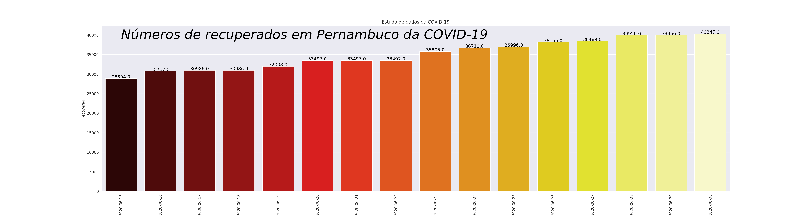
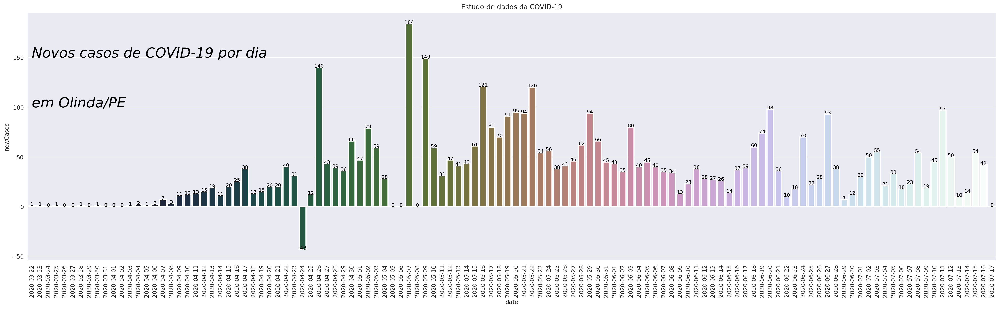
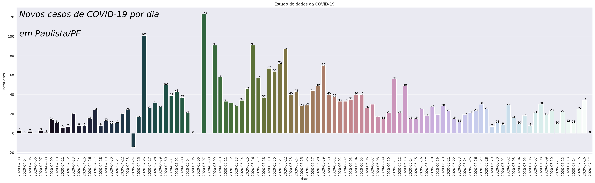
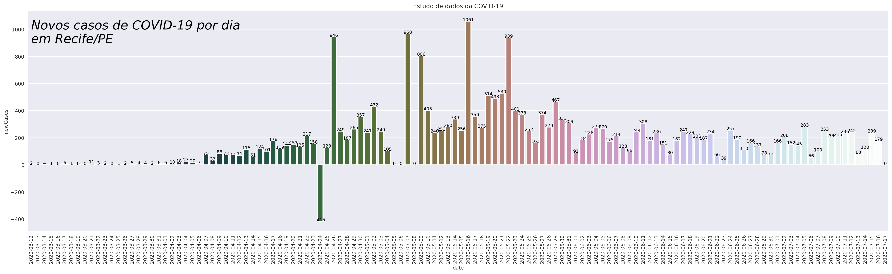
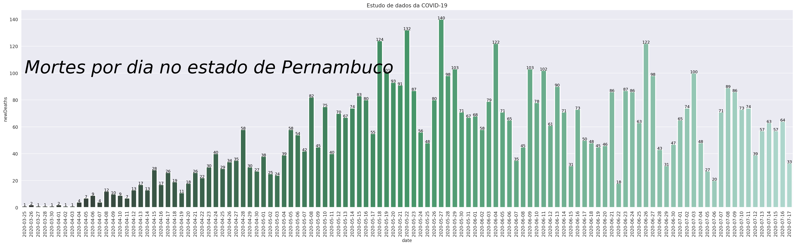
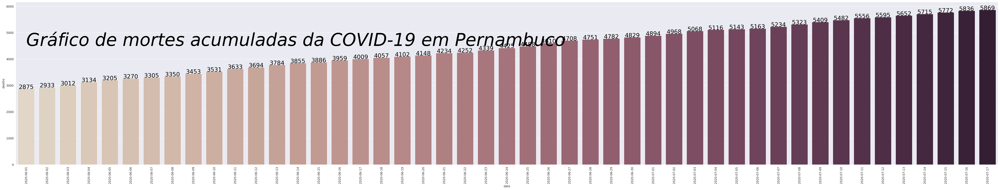

# Covid-19 Pernambuco

Devido a diversas informações que aparecem na mídia sobre o COVID 19, pensei em focar na análise de dados da minha região, como forma de gerar informação atual de maneira mais transparente de acordo com minha realidade mais próxima.

Este repositório deve servir como treinamento no estudo de mineração de dados utilizando o Pandas e exibindo os gráficos através da biblioteca do Seaborn, todas gerenciadas pelo Python. Usei preferencialmente o Google Colab para rodar este notebook.

