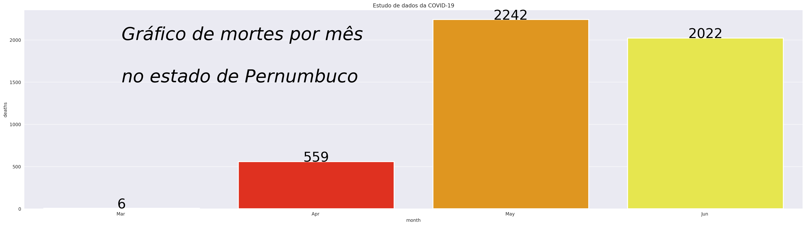

# covid_pernambuco

Devido a diversas informações que aparecem na mídia sobre esse vírus que está assolando o mundo, pensei em focar na análise de dados da minha região, como forma de gerar informação atual e mais coerente com minha realidade mais próxima.

Este repositório deve servir como treinamento no estudo de mineração de dados usando o Pandas e exibindo os gráficos usando a biblioteca do Seaborn, todas usando Python, usei preferencialmente o Google Colab para rodar este notebook.

